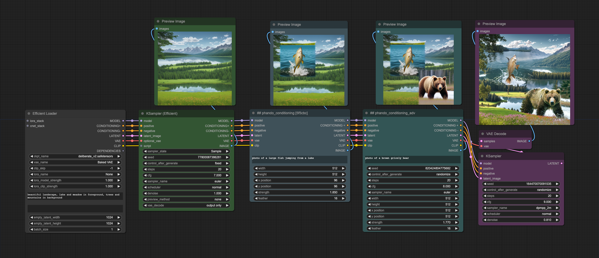
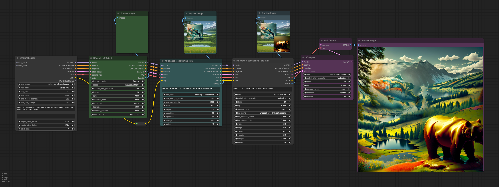

# Phando Nodes for ComfiUI-Workflow-Component

## NOTE: These are not stand alone nodes, they require the [ComfiUI-Workflow-Component](https://github.com/ltdrdata/ComfyUI-Workflow-Component) to work correctly.

### Inspiration
Ever since seeing [Davemane42's Nodes](https://github.com/Davemane42/ComfyUI_Dave_CustomNode) and the [Derfuu Nodes](https://github.com/Derfuu/Derfuu_ComfyUI_ModdedNodes), I have wanted a streamlined workflow. In addition to multi-conditioning, I wanted to do multi conditioning with multi LoRas. This repo is my answer (for now)

## Multi Conditioning

## Multi Conditioning with Multi LoRa

### Nodes:
- phando_conditioning : A node that 
- phando_conditioning_adv
- phando_conditioning_lora
- phando_conditioning_lora_adv

### Workflows:
- phando_conditioning
- phando_conditioning_lora

### Install
- Install the [ComfiUI-Workflow-Component](https://github.com/ltdrdata/ComfyUI-Workflow-Component) custom nodes.
- Drop the phando folder from the repo into your .../custom_nodes/ComfyUI-Workflow-Component/components folder.
- Restart ComfyUI

